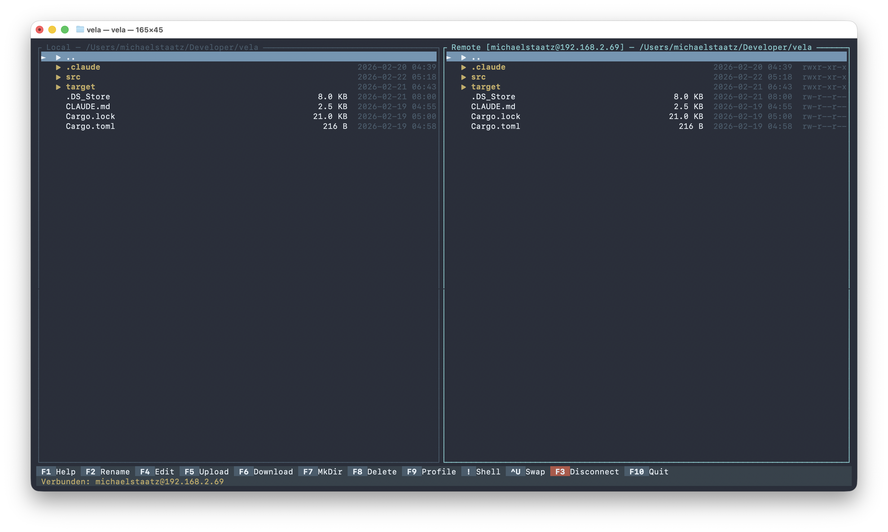
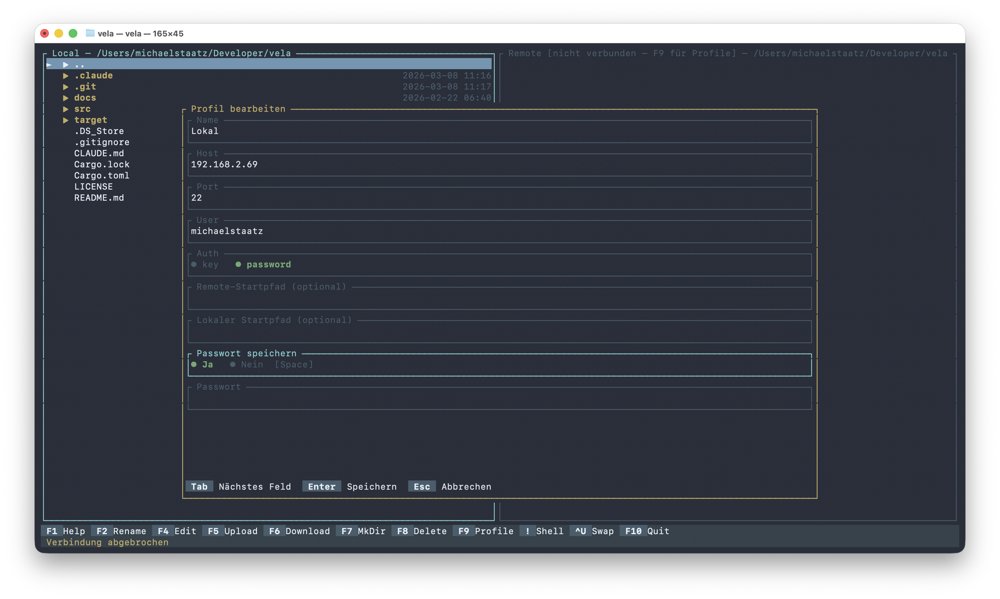
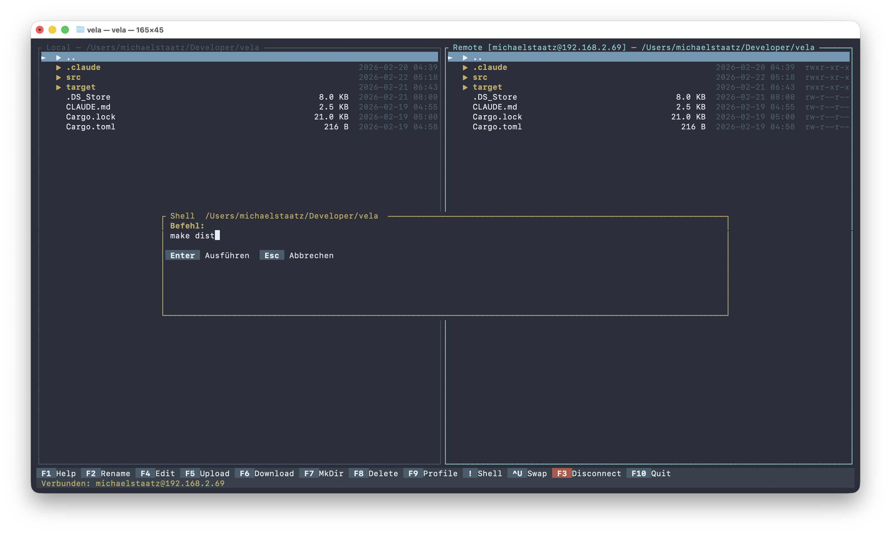
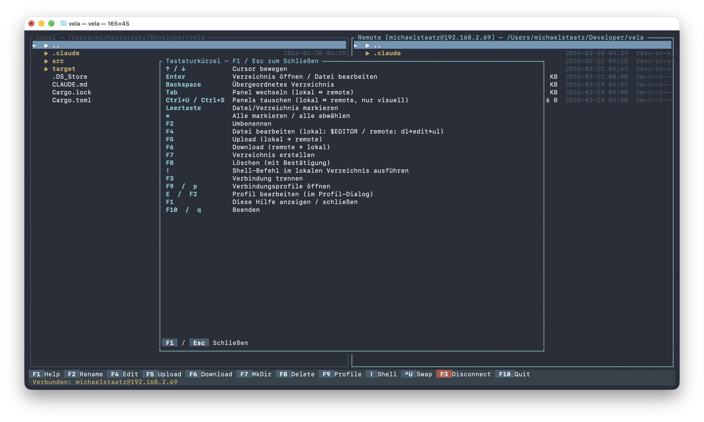
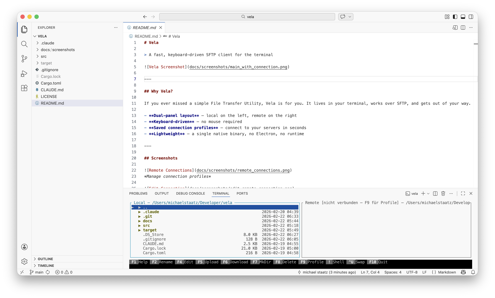

# Vela

> A fast, keyboard-driven SFTP client for the terminal



---

## Why Vela?

If you ever missed a simple File Transfer Utility, Vela is for you. It lives in your terminal, works over SFTP, and gets out of your way.

- **Dual-panel layout** — local on the left, remote on the right
- **Keyboard-driven** — no mouse required
- **Saved connection profiles** — connect to your servers in seconds
- **Lightweight** — a single native binary, no Electron, no runtime

---

## Screenshots


*Manage connection profiles*


*Edit a connection profile*


*Execute a shell command in the local directory*


*Keyboard shortcuts overview (F1)*


*Vela in the integrated VSCode terminal*

---

## Features

- SFTP support over SSH
- Dual-panel file browser with keyboard navigation
- Saved connection profiles (`~/.config/vela/profiles.toml`)
- Upload, download, rename, delete, and create directories
- Multi-select files with `Space` and `*`
- Edit remote files directly — opens in your local editor, uploads on save
- Execute local shell commands (e.g. `make`, `make deploy`) without leaving Vela
- Diff local vs remote files
- Change permissions (chmod) on remote files
- Transfer progress bar with file count

---

## Installation

### From source

Make sure you have [Rust](https://rustup.rs) installed, then:

```bash
git clone https://github.com/staatzstreich/vela.git
cd vela
cargo build --release
```

The binary will be at `target/release/vela`. Copy it to your PATH:

```bash
cp target/release/vela /usr/local/bin/
```

### Via cargo install (directly from GitHub)

```bash
cargo install --git https://github.com/staatzstreich/vela
```

---

## Getting Started

Launch Vela in your terminal:

```bash
vela
```

Press `F9` or `p` to open the profile manager and add your first server connection.

---

## Keyboard Shortcuts

| Key | Action |
|-----|--------|
| `↑` / `↓` | Move cursor |
| `Tab` | Switch panel |
| `Enter` | Open directory |
| `Backspace` | Go up one directory |
| `Space` | Select / deselect file |
| `*` | Select / deselect all |
| `F1` | Show help |
| `F2` | Rename |
| `F4` | Edit file in `$EDITOR` |
| `F5` | Upload / Download |
| `F6` | Move |
| `F7` | Create directory |
| `F8` | Delete |
| `F9` / `p` | Connection profiles |
| `F3` | Disconnect |
| `F10` / `q` | Quit |
| `!` | Execute shell command in local directory |

---

## Configuration

Profiles are stored in `~/.config/vela/profiles.toml`:

```toml
[[profile]]
name = "My Server"
host = "example.com"
port = 22
user = "deploy"
auth = "key"
key_path = "~/.ssh/id_rsa"
remote_path = "/var/www/html"
```

Set `auth = "password"` to use password authentication instead of an SSH key.
The optional `remote_path` field sets the initial remote directory after connecting.

---

## Editor Support

Vela looks for an editor in this order:

1. `$EDITOR` environment variable
2. `$VISUAL` environment variable
3. `vim`
4. `nano`
5. `vi`

To always use a specific editor, set `$EDITOR` in your shell profile:

```bash
export EDITOR=vim
```

---

## Platform Support

| Platform | Status |
|----------|--------|
| macOS | ✅ Supported |
| Linux | ✅ Supported |
| Windows | ❌ Not supported |

---

## Built With

- [Rust](https://www.rust-lang.org)
- [ratatui](https://ratatui.rs) — Terminal UI framework
- [ssh2](https://crates.io/crates/ssh2) — SFTP over SSH
- [serde](https://serde.rs) + [toml](https://crates.io/crates/toml) — Configuration

---

## License

MIT — see [LICENSE](LICENSE) for details.
